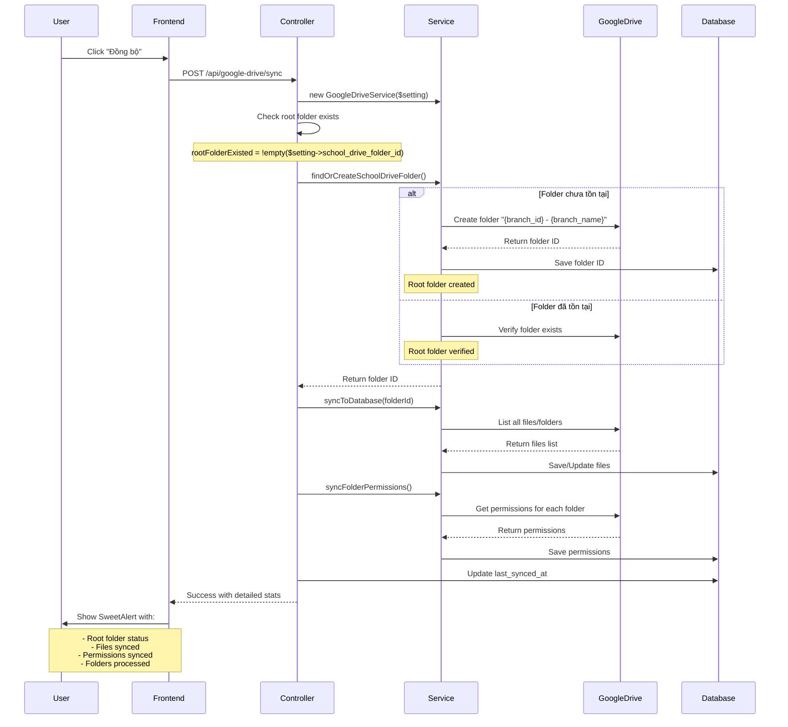

# Nút "Đồng bộ" trong Google Drive Management

## Tổng quan

Nút **"Đồng bộ"** trong giao diện Quản lý Google Drive (không phải trong Settings) đã được cải thiện để:

1. ✅ **Kiểm tra folder root của branch trước khi sync**
2. ✅ **Tự động tạo folder root nếu chưa có** (format: `{branch_id} - {branch_name}`)
3. ✅ **Hiển thị thông tin chi tiết** về folder root trong kết quả sync

---

## Vị trí nút "Đồng bộ"

### UI Location

```
┌─────────────────────────────────────────────────────┐
│ Quản lý Google Drive                                 │
│ School Drive                                         │
│                                   [Đồng bộ] [Cài đặt]│
└─────────────────────────────────────────────────────┘
│ School Drive                      [Tải lên] [Thư mục mới]│
└─────────────────────────────────────────────────────┘
│ 4 items                                    [Grid] [List] │
└─────────────────────────────────────────────────────┘
```

### Route
- URL: https://admin.songthuy.edu.vn/google-drive
- Component: `GoogleDriveIndex.vue`
- API: `POST /api/google-drive/sync`

---

## Flow hoạt động



---

## Code Implementation

### 1. Backend - GoogleDriveController.php

**Method `sync()` improvements:**

```php
public function sync(Request $request)
{
    try {
        // ... get branch and setting ...
        
        $service = new GoogleDriveService($setting);
        
        // 🆕 Check if root folder existed before sync
        $rootFolderExisted = !empty($setting->school_drive_folder_id);
        
        // 🆕 Get School Drive folder ID (will create if not exists)
        $folderId = $service->findOrCreateSchoolDriveFolder();
        
        // 🆕 Reload setting to get updated folder name
        $setting->refresh();

        Log::info('[GoogleDrive] Root folder ready for sync', [
            'folder_id' => $folderId,
            'folder_name' => $setting->school_drive_folder_name,
            'folder_existed' => $rootFolderExisted,
        ]);

        // Sync files/folders from this folder
        $syncedCount = $service->syncToDatabase($folderId, $branchId);

        // Sync permissions...
        
        // 🆕 Prepare detailed message
        $folderAction = $rootFolderExisted ? 'đã được xác minh' : 'vừa được tạo mới';

        return response()->json([
            'success' => true,
            'message' => __('messages.sync_completed_successfully'),
            'data' => [
                'root_folder_name' => $setting->school_drive_folder_name,      // 🆕
                'root_folder_action' => $folderAction,                          // 🆕
                'root_folder_existed' => $rootFolderExisted,                   // 🆕
                'files_synced' => $syncedCount,
                'permissions_synced' => $permissionsSynced,
                'folders_processed' => $folders->count(),
            ],
        ]);
    } catch (\Exception $e) {
        // Error handling...
    }
}
```

### 2. Frontend - GoogleDriveIndex.vue

**Method `showSyncDialog()` improvements:**

```javascript
const showSyncDialog = async () => {
  syncing.value = true;
  try {
    const response = await axios.post('/api/google-drive/sync');
    if (response.data.success) {
      const data = response.data.data || {};
      
      // 🆕 Extract root folder info
      const rootFolderName = data.root_folder_name || '';
      const rootFolderAction = data.root_folder_action || '';
      const rootFolderExisted = data.root_folder_existed || false;
      
      const filesSynced = data.files_synced || 0;
      const permissionsSynced = data.permissions_synced || 0;
      const foldersProcessed = data.folders_processed || 0;
      
      // 🆕 Build root folder status message
      let rootFolderStatus = '';
      if (rootFolderName) {
        const statusIcon = rootFolderExisted ? '✓' : '🆕';
        rootFolderStatus = `
          <div class="mb-4 p-3 bg-blue-50 border border-blue-200 rounded">
            <p class="font-semibold text-blue-900 mb-1">${statusIcon} Root Folder:</p>
            <p class="text-blue-800">${rootFolderName}</p>
            <p class="text-sm text-blue-600 mt-1">(${rootFolderAction})</p>
          </div>
        `;
      }
      
      // Show detailed success message
      await Swal.fire({
        icon: 'success',
        title: t('messages.sync_completed_successfully'),
        html: `
          ${rootFolderStatus}
          <div class="text-left space-y-2">
            <p><strong>${t('google_drive.files_synced')}:</strong> ${filesSynced}</p>
            <p><strong>${t('google_drive.permissions_synced')}:</strong> ${permissionsSynced}</p>
            <p><strong>${t('google_drive.folders_processed')}:</strong> ${foldersProcessed}</p>
          </div>
        `,
        confirmButtonText: t('common.ok'),
      });
      
      await loadFiles(currentFolderId.value);
    }
  } catch (error) {
    console.error('Error syncing:', error);
    showError(error.response?.data?.message || t('common.error_occurred'));
  } finally {
    syncing.value = false;
  }
};
```

---

## Testing Scenarios

### Scenario 1: First Sync (Folder chưa tồn tại)

**Setup:**
```sql
-- Xóa folder ID để giả lập branch chưa có folder
UPDATE google_drive_settings 
SET school_drive_folder_id = NULL, school_drive_folder_name = NULL
WHERE branch_id = 1;
```

**Steps:**
1. Truy cập: https://admin.songthuy.edu.vn/google-drive
2. Click nút **"Đồng bộ"** (màu xanh)

**Expected Result:**

**SweetAlert hiển thị:**
```
┌─────────────────────────────────────────┐
│ ✓ Sync Completed Successfully           │
├─────────────────────────────────────────┤
│ ┌───────────────────────────────────┐   │
│ │ 🆕 Root Folder:                   │   │
│ │ 1 - Chi Nhánh Hà Nội             │   │
│ │ (vừa được tạo mới)                │   │
│ └───────────────────────────────────┘   │
│                                         │
│ Files synced: 4                         │
│ Permissions synced: 12                  │
│ Folders processed: 3                    │
│                                         │
│                            [OK]         │
└─────────────────────────────────────────┘
```

**Log verification:**
```log
[GoogleDrive] Root folder ready for sync {
    "folder_id": "1-sdpIxYDg-U9b2OOOWD0SxPwaphLun4H",
    "folder_name": "1 - Chi Nhánh Hà Nội",
    "folder_existed": false
}
```

---

### Scenario 2: Subsequent Sync (Folder đã tồn tại)

**Setup:**
- Folder đã có từ lần sync trước

**Steps:**
1. Click nút **"Đồng bộ"** lần nữa

**Expected Result:**

**SweetAlert hiển thị:**
```
┌─────────────────────────────────────────┐
│ ✓ Sync Completed Successfully           │
├─────────────────────────────────────────┤
│ ┌───────────────────────────────────┐   │
│ │ ✓ Root Folder:                    │   │
│ │ 1 - Chi Nhánh Hà Nội             │   │
│ │ (đã được xác minh)                │   │
│ └───────────────────────────────────┘   │
│                                         │
│ Files synced: 5                         │
│ Permissions synced: 15                  │
│ Folders processed: 4                    │
│                                         │
│                            [OK]         │
└─────────────────────────────────────────┘
```

**Log verification:**
```log
[GoogleDrive] Root folder ready for sync {
    "folder_id": "1-sdpIxYDg-U9b2OOOWD0SxPwaphLun4H",
    "folder_name": "1 - Chi Nhánh Hà Nội",
    "folder_existed": true
}
```

---

### Scenario 3: Branch name changed (Update folder name)

**Setup:**
```sql
UPDATE branches SET name = 'Chi Nhánh Hà Nội - Mới' WHERE id = 1;
```

**Steps:**
1. Click nút **"Đồng bộ"**

**Expected Result:**

**SweetAlert hiển thị:**
```
┌─────────────────────────────────────────┐
│ ✓ Sync Completed Successfully           │
├─────────────────────────────────────────┤
│ ┌───────────────────────────────────┐   │
│ │ ✓ Root Folder:                    │   │
│ │ 1 - Chi Nhánh Hà Nội - Mới       │   │
│ │ (đã được xác minh)                │   │
│ └───────────────────────────────────┘   │
│                                         │
│ Files synced: 5                         │
│ Permissions synced: 15                  │
│ Folders processed: 4                    │
│                                         │
│                            [OK]         │
└─────────────────────────────────────────┘
```

**Verification:**
- Folder name trên Google Drive đã update
- Database cũng đã update

---

### Scenario 4: Folder bị xóa trên Google Drive

**Setup:**
1. Xóa thủ công folder `1 - Chi Nhánh Hà Nội` trên Google Drive
2. Folder ID vẫn còn trong database

**Steps:**
1. Click nút **"Đồng bộ"**

**Expected Result:**

**SweetAlert hiển thị:**
```
┌─────────────────────────────────────────┐
│ ✓ Sync Completed Successfully           │
├─────────────────────────────────────────┤
│ ┌───────────────────────────────────┐   │
│ │ 🆕 Root Folder:                   │   │
│ │ 1 - Chi Nhánh Hà Nội             │   │
│ │ (vừa được tạo mới)                │   │
│ └───────────────────────────────────┘   │
│                                         │
│ Files synced: 0                         │
│ Permissions synced: 0                   │
│ Folders processed: 0                    │
│                                         │
│                            [OK]         │
└─────────────────────────────────────────┘
```

**Behavior:**
- Hệ thống phát hiện folder không tồn tại
- Tự động tạo lại folder mới
- Sync lại tất cả files/folders

---

## API Response Format

### Success Response

```json
{
  "success": true,
  "message": "Sync completed successfully",
  "data": {
    "root_folder_name": "1 - Chi Nhánh Hà Nội",
    "root_folder_action": "vừa được tạo mới",
    "root_folder_existed": false,
    "files_synced": 4,
    "permissions_synced": 12,
    "folders_processed": 3
  }
}
```

### Error Response

```json
{
  "success": false,
  "message": "Sync failed: Access token expired"
}
```

---

## UI Components

### Button States

**Normal state:**
```html
<button class="bg-blue-600 text-white">
  <svg><!-- sync icon --></svg>
  <span>Đồng bộ</span>
</button>
```

**Syncing state:**
```html
<button class="bg-blue-600 text-white disabled:opacity-50" disabled>
  <svg class="animate-spin"><!-- sync icon --></svg>
  <span>Đang đồng bộ...</span>
</button>
```

### Success Modal (SweetAlert)

```html
<div class="swal2-popup">
  <div class="swal2-icon swal2-success"></div>
  <h2>Sync Completed Successfully</h2>
  
  <!-- Root Folder Status -->
  <div class="bg-blue-50 border-blue-200 rounded p-3 mb-4">
    <p class="font-semibold text-blue-900">
      🆕 Root Folder:  <!-- or ✓ if existed -->
    </p>
    <p class="text-blue-800">1 - Chi Nhánh Hà Nội</p>
    <p class="text-sm text-blue-600">(vừa được tạo mới)</p>
  </div>
  
  <!-- Sync Statistics -->
  <div class="text-left">
    <p><strong>Files synced:</strong> 4</p>
    <p><strong>Permissions synced:</strong> 12</p>
    <p><strong>Folders processed:</strong> 3</p>
  </div>
  
  <button class="swal2-confirm">OK</button>
</div>
```

---

## Logs

### Successful Sync Logs

```
[GoogleDrive] Testing connection {"user_id":1,"branch_id":1}
[GoogleDrive] Root folder ready for sync {
    "folder_id":"1-sdpIxYDg-U9b2OOOWD0SxPwaphLun4H",
    "folder_name":"1 - Chi Nhánh Hà Nội",
    "folder_existed":false
}
[GoogleDrive] Sync completed {
    "branch_id":1,
    "root_folder_name":"1 - Chi Nhánh Hà Nội",
    "root_folder_existed":false,
    "files_synced":4,
    "permissions_synced":12,
    "folders_processed":3
}
```

---

## Summary

✅ **Nút "Đồng bộ" tự động kiểm tra folder root**  
✅ **Tự động tạo folder nếu chưa có** với format `{branch_id} - {branch_name}`  
✅ **Hiển thị chi tiết** về folder root trong kết quả sync  
✅ **Icon phân biệt**: 🆕 cho folder mới, ✓ cho folder đã tồn tại  
✅ **Auto-recovery**: Tự động tạo lại nếu folder bị xóa  
✅ **Multi-branch support**: Mỗi branch có folder riêng  

Nút "Đồng bộ" giờ đây cung cấp **visibility đầy đủ** về trạng thái root folder! 🎉

