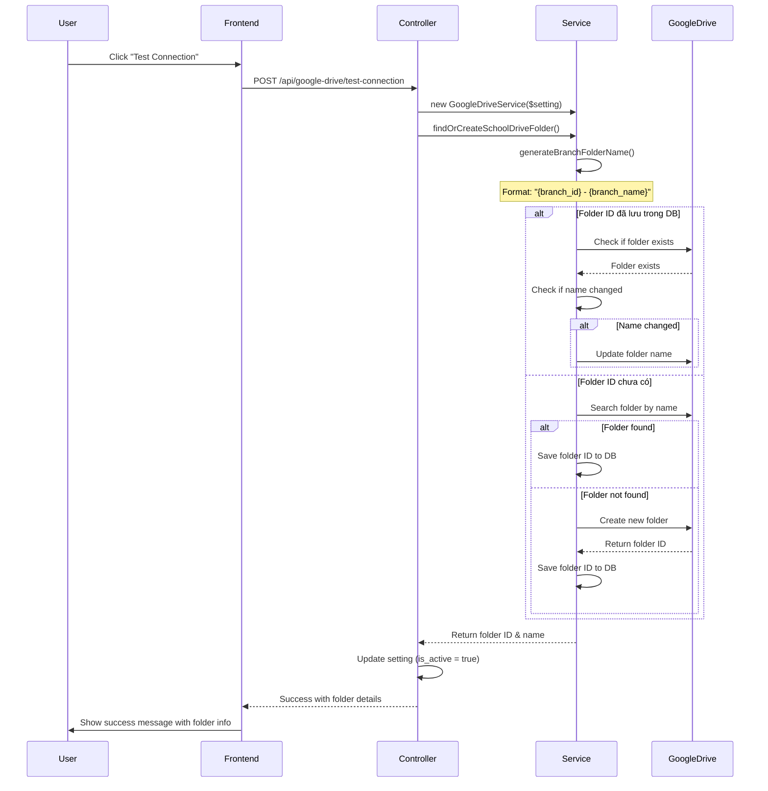

# Test Google Drive Root Folder Synchronization

## Mục đích

Khi click nút "Test Connection" (Đồng bộ), hệ thống sẽ:

1. ✅ **Kiểm tra xem có folder root của branch chưa**
2. ✅ **Nếu chưa có → Tạo mới với tên: `{branch_id} - {branch_name}`**
3. ✅ **Nếu đã có → Verify folder vẫn tồn tại và update tên nếu cần**
4. ✅ **Hiển thị thông báo chi tiết** về trạng thái folder

---

## Flow hoạt động



---

## Code thay đổi

### 1. GoogleDriveController.php

**Cải thiện response để show chi tiết folder:**

```php
// Check if folder already exists before creating
$folderExisted = !empty($setting->school_drive_folder_id);

// Try to find or create School Drive folder
$folderId = $service->findOrCreateSchoolDriveFolder();

// Reload setting to get updated folder name
$setting->refresh();

// Prepare user-friendly message
$folderAction = $folderExisted ? 'verified and ready' : 'created successfully';
$message = "Connection successful! Root folder '{$setting->school_drive_folder_name}' has been {$folderAction}.";

return response()->json([
    'success' => true,
    'message' => $message,
    'data' => [
        'folder_id' => $folderId,
        'folder_name' => $setting->school_drive_folder_name,
        'folder_existed' => $folderExisted,
        'branch_id' => $setting->branch_id,
        'branch_name' => $setting->branch?->name,
    ],
]);
```

### 2. GoogleDriveSettingsContent.vue

**Hiển thị thông báo chi tiết:**

```javascript
const testGoogleDriveConnection = async () => {
  testing.value = true;
  try {
    const response = await axios.post('/api/google-drive/test-connection');
    if (response.data.success) {
      const data = response.data.data;
      
      // Show detailed success message
      let message = response.data.message;
      if (data?.folder_name) {
        message += `\n\nFolder: ${data.folder_name}`;
        if (data.folder_existed) {
          message += ' ✓ (Đã tồn tại và đã được xác minh)';
        } else {
          message += ' ✓ (Vừa được tạo mới)';
        }
      }
      
      showSuccess(message);
      await loadGoogleDriveStatus();
    }
  } catch (error) {
    console.error('Error testing connection:', error);
    showError(error.response?.data?.message || t('google_drive.connection_failed'));
  } finally {
    testing.value = false;
  }
};
```

---

## Testing Steps

### Test Case 1: Tạo folder mới (Branch chưa có folder)

**Setup:**
```sql
-- Xóa folder ID để giả lập branch chưa có folder
UPDATE google_drive_settings 
SET school_drive_folder_id = NULL, school_drive_folder_name = NULL
WHERE branch_id = 1;
```

**Steps:**
1. Truy cập: https://admin.songthuy.edu.vn/settings
2. Chọn tab "Google Drive"
3. Click nút "Test Connection"

**Expected Result:**
```
✓ Connection successful! 
  Root folder '1 - Chi Nhánh Hà Nội' has been created successfully.

  Folder: 1 - Chi Nhánh Hà Nội ✓ (Vừa được tạo mới)
```

**Verification:**
```sql
SELECT branch_id, school_drive_folder_id, school_drive_folder_name 
FROM google_drive_settings 
WHERE branch_id = 1;

-- Output:
-- branch_id | school_drive_folder_id              | school_drive_folder_name
-- 1         | 1-sdpIxYDg-U9b2OOOWD0SxPwaphLun4H  | 1 - Chi Nhánh Hà Nội
```

### Test Case 2: Verify folder đã tồn tại

**Setup:**
```sql
-- Folder đã có trong DB
SELECT school_drive_folder_id FROM google_drive_settings WHERE branch_id = 1;
-- Result: 1-sdpIxYDg-U9b2OOOWD0SxPwaphLun4H
```

**Steps:**
1. Click nút "Test Connection" lần nữa

**Expected Result:**
```
✓ Connection successful! 
  Root folder '1 - Chi Nhánh Hà Nội' has been verified and ready.

  Folder: 1 - Chi Nhánh Hà Nội ✓ (Đã tồn tại và đã được xác minh)
```

### Test Case 3: Update tên folder khi branch name thay đổi

**Setup:**
```sql
-- Đổi tên branch
UPDATE branches SET name = 'Chi Nhánh Hà Nội - Mới' WHERE id = 1;
```

**Steps:**
1. Click nút "Test Connection"

**Expected Result:**
```
✓ Connection successful! 
  Root folder '1 - Chi Nhánh Hà Nội - Mới' has been verified and ready.

  Folder: 1 - Chi Nhánh Hà Nội - Mới ✓ (Đã tồn tại và đã được xác minh)
```

**Verification:**
- Folder name trên Google Drive đã được update
- Database cũng đã update:
```sql
SELECT school_drive_folder_name FROM google_drive_settings WHERE branch_id = 1;
-- Result: 1 - Chi Nhánh Hà Nội - Mới
```

### Test Case 4: Multiple branches

**Setup:**
```sql
-- Tạo thêm branch
INSERT INTO branches (name, code, is_active) VALUES ('Chi Nhánh TP.HCM', 'HCM', true);

-- Tạo Google Drive setting cho branch mới
INSERT INTO google_drive_settings (
    branch_id, client_id, client_secret, refresh_token, is_active
) VALUES (
    2, 
    'same_client_id', 
    'same_client_secret', 
    'refresh_token_from_oauth',
    true
);
```

**Steps:**
1. Switch sang Branch 2 (TP.HCM)
2. Click "Test Connection"

**Expected Result:**
- Branch 1 có folder: `1 - Chi Nhánh Hà Nội`
- Branch 2 có folder: `2 - Chi Nhánh TP.HCM`
- Mỗi folder độc lập, không ảnh hưởng lẫn nhau

### Test Case 5: Folder bị xóa trên Google Drive

**Setup:**
1. Xóa thủ công folder trên Google Drive
2. Folder ID vẫn còn trong database

**Steps:**
1. Click "Test Connection"

**Expected Result:**
```
✓ Connection successful! 
  Root folder '1 - Chi Nhánh Hà Nội' has been created successfully.

  Folder: 1 - Chi Nhánh Hà Nội ✓ (Vừa được tạo mới)
```

**Behavior:**
- Hệ thống phát hiện folder ID không còn tồn tại
- Tự động tạo lại folder mới
- Update folder ID mới vào database

---

## API Response Format

### Success Response

```json
{
  "success": true,
  "message": "Connection successful! Root folder '1 - Chi Nhánh Hà Nội' has been created successfully.",
  "data": {
    "folder_id": "1-sdpIxYDg-U9b2OOOWD0SxPwaphLun4H",
    "folder_name": "1 - Chi Nhánh Hà Nội",
    "folder_existed": false,
    "branch_id": 1,
    "branch_name": "Chi Nhánh Hà Nội"
  }
}
```

### Error Response

```json
{
  "success": false,
  "message": "Connection failed: Access token expired and refresh token is invalid"
}
```

---

## Log Messages

Trong `storage/logs/laravel.log`:

```
[GoogleDrive] Testing connection {"user_id":1,"branch_id":1}
[GoogleDrive] Settings found, testing connection {"setting_id":1,"has_client_id":true,"has_client_secret":true,"has_refresh_token":true}
[GoogleDrive] Finding or creating School Drive folder {"branch_id":1,"folder_name":"1 - Chi Nhánh Hà Nội"}
[GoogleDrive] School Drive folder already exists {"folder_id":"1-sdpIxYDg-U9b2OOOWD0SxPwaphLun4H","current_name":"School Drive","new_name":"1 - Chi Nhánh Hà Nội"}
[GoogleDrive] Folder name changed, updating...
[GoogleDrive] Folder name updated {"folder_id":"1-sdpIxYDg-U9b2OOOWD0SxPwaphLun4H","new_name":"1 - Chi Nhánh Hà Nội"}
[GoogleDrive] School Drive folder ready {"folder_id":"1-sdpIxYDg-U9b2OOOWD0SxPwaphLun4H","folder_name":"1 - Chi Nhánh Hà Nội"}
[GoogleDrive] Connection test successful {"folder_id":"1-sdpIxYDg-U9b2OOOWD0SxPwaphLun4H","folder_name":"1 - Chi Nhánh Hà Nội","folder_existed":true}
```

---

## Troubleshooting

### Issue 1: Thông báo "Please save Google Drive settings first"

**Cause:** Chưa có record trong bảng `google_drive_settings`

**Solution:**
1. Nhập Client ID và Client Secret
2. Click "Authorize with Google"
3. Sau khi authorize xong, click "Test Connection"

### Issue 2: Folder name không update

**Cause:** Service cached folder name cũ

**Solution:**
```bash
# Chạy sync command
php artisan google-drive:sync-branch-folders
```

### Issue 3: Token expired

**Cause:** Access token và refresh token đều hết hạn

**Solution:**
1. Click "Re-authorize with Google"
2. Authorize lại
3. Click "Test Connection"

---

## Performance Notes

**First call (folder chưa tồn tại):**
- 1 API call: Search folder by name
- 1 API call: Create folder
- Total: ~2-3 seconds

**Subsequent calls (folder đã tồn tại):**
- 1 API call: Verify folder exists
- Total: ~0.5-1 second

**Name changed:**
- 1 API call: Verify folder exists
- 1 API call: Update folder name
- Total: ~1-2 seconds

---

## Security Considerations

✅ **Branch isolation:** Mỗi branch chỉ có thể tạo/truy cập folder của mình  
✅ **Permission check:** Chỉ user có quyền `google-drive.settings` mới được test connection  
✅ **Token security:** Access token được tự động refresh khi expired  
✅ **Audit log:** Tất cả actions được log vào `laravel.log`

---

## Summary

✅ **Click "Test Connection" → Tự động kiểm tra folder root**  
✅ **Chưa có folder → Tự động tạo mới với format `{branch_id} - {branch_name}`**  
✅ **Đã có folder → Verify và update name nếu cần**  
✅ **Hiển thị message rõ ràng** về trạng thái folder (mới tạo hay đã tồn tại)  
✅ **Multi-branch support** - Mỗi branch có folder riêng  
✅ **Auto-recovery** - Tự động tạo lại nếu folder bị xóa  

Hệ thống đã sẵn sàng! 🎉

