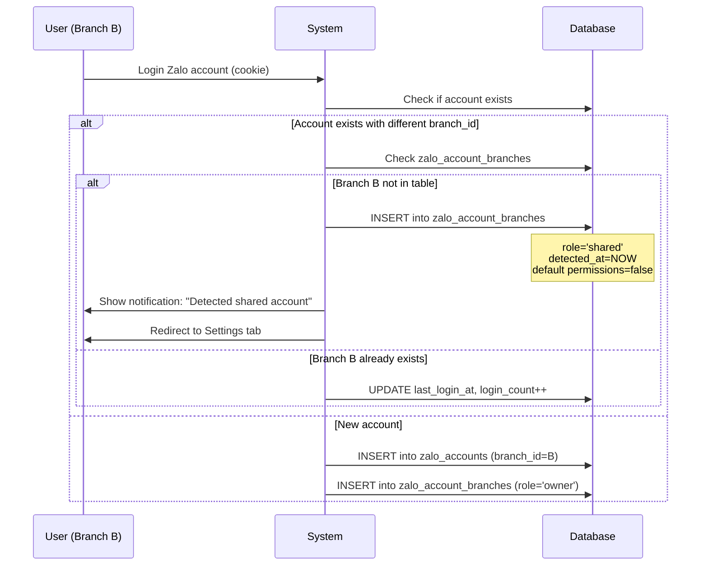
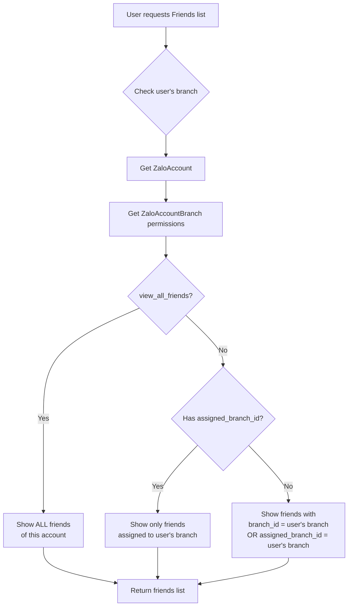
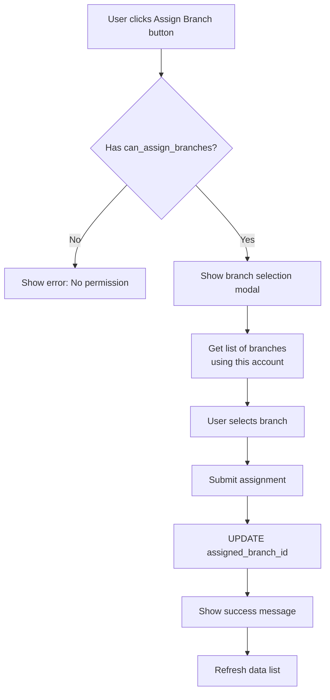

# 🎯 ZALO MULTI-BRANCH ACCESS - THIẾT KẾ HOÀN CHỈNH

**Ngày:** 27/11/2025
**Version:** 2.0 - Bổ sung granular permissions & auto-detection
**Trạng thái:** 📝 THIẾT KẾ HOÀN CHỈNH

---

## 📋 YÊU CẦU BỔ SUNG (v2.0)

### 1. Auto-Detection Khi Login
Khi một branch mới đăng nhập cùng tài khoản Zalo:
- ✅ Hệ thống tự động phát hiện
- ✅ Tạo share record tự động trong settings
- ✅ Hiển thị danh sách branches đang dùng chung account

### 2. Granular Data Permissions
Không chỉ "view all", mà phải chi tiết:
- **View All Groups** hoặc chỉ **Groups được gán cho branch**
- **View All Friends** hoặc chỉ **Friends được gán cho branch**
- **View All Conversations** hoặc chỉ **Conversations được gán cho branch**

### 3. Branch Assignment System
- Có chức năng **gán branch** cho groups, friends, conversations
- Ví dụ: Group "Lớp Toán A1" → Gán cho Branch "Hà Nội"
- Branch Hà Nội có quyền quản lý group này
- Branch khác (nếu có permission) chỉ xem

### 4. System-Level Permission
- Permission tổng: `zalo.manage_multi_branch_access`
- Chỉ user có permission này mới thấy tab Settings
- Control việc manage shares, assignments

---

## 🔧 THIẾT KẾ DATABASE (REVISED)

### 1. Bảng `zalo_account_branches` (RENAMED từ zalo_account_shares)

**Mục đích:** Track branches đang sử dụng cùng 1 Zalo account

```sql
CREATE TABLE zalo_account_branches (
    id                          BIGINT UNSIGNED PRIMARY KEY AUTO_INCREMENT,
    zalo_account_id             BIGINT UNSIGNED NOT NULL,
    branch_id                   BIGINT UNSIGNED NOT NULL,

    -- Role trong account này
    role                        ENUM('owner', 'shared') DEFAULT 'shared',

    -- Permissions: Sending
    can_send_to_customers       BOOLEAN DEFAULT FALSE,
    can_send_to_teachers        BOOLEAN DEFAULT FALSE,
    can_send_to_groups          BOOLEAN DEFAULT FALSE,

    -- Permissions: Data Viewing (granular)
    view_all_friends            BOOLEAN DEFAULT FALSE,  -- True = xem tất cả, False = chỉ xem assigned
    view_all_groups             BOOLEAN DEFAULT FALSE,
    view_all_conversations      BOOLEAN DEFAULT FALSE,

    -- Permissions: Data Management
    can_assign_branches         BOOLEAN DEFAULT FALSE,  -- Quyền gán branch cho data
    can_manage_shares           BOOLEAN DEFAULT FALSE,  -- Quyền quản lý shares

    -- Metadata
    detected_at                 TIMESTAMP NULL,         -- Khi nào detect login
    last_login_at               TIMESTAMP NULL,         -- Last login của branch này
    login_count                 INT DEFAULT 0,          -- Số lần login
    notes                       TEXT NULL,

    created_at                  TIMESTAMP NULL,
    updated_at                  TIMESTAMP NULL,

    FOREIGN KEY (zalo_account_id) REFERENCES zalo_accounts(id) ON DELETE CASCADE,
    FOREIGN KEY (branch_id) REFERENCES branches(id) ON DELETE CASCADE,

    UNIQUE KEY unique_account_branch (zalo_account_id, branch_id)
);

CREATE INDEX idx_role ON zalo_account_branches(role);
CREATE INDEX idx_branch_id ON zalo_account_branches(branch_id);
```

**Giải thích:**
- `role = 'owner'`: Branch đăng nhập đầu tiên, có quyền cao nhất
- `role = 'shared'`: Branch login sau, cần được cấp quyền
- Permissions chi tiết cho từng loại action
- Track login history để audit

---

### 2. Cập nhật bảng `zalo_friends`

**Thêm cột assignment:**

```sql
ALTER TABLE zalo_friends
ADD COLUMN assigned_branch_id BIGINT UNSIGNED NULL AFTER branch_id,
ADD FOREIGN KEY (assigned_branch_id) REFERENCES branches(id) ON DELETE SET NULL;

CREATE INDEX idx_assigned_branch ON zalo_friends(assigned_branch_id);
```

**Logic:**
- `branch_id`: Branch của account owner (inherited, đã có)
- `assigned_branch_id`: Branch được gán để quản lý friend này (NEW)
- Nếu NULL = chưa gán, có thể là "global" hoặc "owner only"

---

### 3. Cập nhật bảng `zalo_groups`

```sql
-- Already has branch_id and department_id
-- Add assigned tracking

ALTER TABLE zalo_groups
ADD COLUMN assigned_branch_id BIGINT UNSIGNED NULL AFTER branch_id,
ADD COLUMN assigned_department_id BIGINT UNSIGNED NULL AFTER department_id,
ADD COLUMN is_global BOOLEAN DEFAULT FALSE,  -- Group toàn hệ thống
ADD FOREIGN KEY (assigned_branch_id) REFERENCES branches(id) ON DELETE SET NULL,
ADD FOREIGN KEY (assigned_department_id) REFERENCES departments(id) ON DELETE SET NULL;

CREATE INDEX idx_assigned_branch_group ON zalo_groups(assigned_branch_id);
CREATE INDEX idx_is_global ON zalo_groups(is_global);
```

**Logic:**
- `branch_id`: Owner branch (inherited from account)
- `assigned_branch_id`: Branch được gán quản lý
- `department_id`: Từ class assignment
- `assigned_department_id`: Manual assignment
- `is_global`: Group toàn trường (all branches can see)

---

### 4. Cập nhật bảng `zalo_conversations`

```sql
-- Already has branch_id and department_id

ALTER TABLE zalo_conversations
ADD COLUMN assigned_branch_id BIGINT UNSIGNED NULL AFTER branch_id,
ADD COLUMN assigned_department_id BIGINT UNSIGNED NULL AFTER department_id,
ADD COLUMN assigned_to BIGINT UNSIGNED NULL,  -- User được assign
ADD FOREIGN KEY (assigned_branch_id) REFERENCES branches(id) ON DELETE SET NULL,
ADD FOREIGN KEY (assigned_department_id) REFERENCES departments(id) ON DELETE SET NULL,
ADD FOREIGN KEY (assigned_to) REFERENCES users(id) ON DELETE SET NULL;

CREATE INDEX idx_assigned_branch_conv ON zalo_conversations(assigned_branch_id);
CREATE INDEX idx_assigned_to ON zalo_conversations(assigned_to);
```

**Logic:**
- Assignment hierarchy: User > Department > Branch
- Conversation có thể gán cho user cụ thể (tư vấn viên chăm sóc)

---

### 5. Bảng `zalo_permissions` (System Permissions)

**Sử dụng Laravel Permission Package**

```php
// Permissions mới
'zalo.manage_multi_branch_access',      // Thấy & quản lý multi-branch settings
'zalo.assign_branches',                  // Gán branch cho data
'zalo.view_all_accounts',                // Xem tất cả accounts (super admin)
'zalo.manage_own_branch_only',           // Chỉ quản lý branch của mình

// Existing permissions
'zalo.send_messages',
'zalo.view_conversations',
'zalo.manage_groups',
...
```

---

## 🔄 FLOW HOẠT ĐỘNG

### Flow 1: Auto-Detection When Login



**Implementation:**

```php
// In ZaloController::reloginAccount() or loginAccount()

public function loginAccount(Request $request)
{
    $cookie = $request->input('cookie');
    $currentBranchId = auth()->user()->branch_id;

    // Check if account exists (by cookie hash or zalo_id)
    $existingAccount = $this->findAccountByCookie($cookie);

    if ($existingAccount) {
        // Different branch detected
        if ($existingAccount->branch_id !== $currentBranchId) {
            // Auto-create share record
            $share = ZaloAccountBranch::firstOrCreate(
                [
                    'zalo_account_id' => $existingAccount->id,
                    'branch_id' => $currentBranchId,
                ],
                [
                    'role' => 'shared',
                    'detected_at' => now(),
                    'last_login_at' => now(),
                    'login_count' => 1,
                    // Default: all permissions false
                ]
            );

            if ($share->wasRecentlyCreated) {
                return response()->json([
                    'success' => true,
                    'message' => 'Tài khoản Zalo này đã được đăng nhập ở chi nhánh khác.',
                    'data' => [
                        'account' => $existingAccount,
                        'owner_branch' => $existingAccount->branch->name,
                        'redirect_to_settings' => true,
                    ],
                ]);
            }

            // Update login tracking
            $share->increment('login_count');
            $share->update(['last_login_at' => now()]);
        }

        return response()->json([
            'success' => true,
            'data' => $existingAccount,
        ]);
    }

    // New account - create as owner
    $account = ZaloAccount::create([
        'branch_id' => $currentBranchId,
        'cookie' => encrypt($cookie),
        'is_active' => true,
        // ...
    ]);

    ZaloAccountBranch::create([
        'zalo_account_id' => $account->id,
        'branch_id' => $currentBranchId,
        'role' => 'owner',
        'detected_at' => now(),
        'last_login_at' => now(),
        // Owner gets all permissions by default
        'can_send_to_customers' => true,
        'can_send_to_teachers' => true,
        'can_send_to_groups' => true,
        'view_all_friends' => true,
        'view_all_groups' => true,
        'view_all_conversations' => true,
        'can_assign_branches' => true,
        'can_manage_shares' => true,
    ]);

    return response()->json([
        'success' => true,
        'data' => $account,
    ]);
}
```

---

### Flow 2: Data Access with Granular Permissions



**Implementation:**

```php
// In ZaloController::getFriends()

public function getFriends(Request $request)
{
    $user = auth()->user();
    $accountId = $request->input('account_id');

    // Get account and check access
    $account = ZaloAccount::find($accountId);
    if (!$account) {
        return $this->error('Account not found');
    }

    // Get user's branch permissions for this account
    $accountBranch = ZaloAccountBranch::where('zalo_account_id', $accountId)
        ->where('branch_id', $user->branch_id)
        ->first();

    if (!$accountBranch) {
        return $this->error('Không có quyền truy cập tài khoản này', 403);
    }

    // Build query based on permissions
    $query = ZaloFriend::where('zalo_account_id', $accountId);

    if (!$accountBranch->view_all_friends) {
        // Restricted view: only assigned to user's branch
        $query->where(function ($q) use ($user) {
            $q->where('assigned_branch_id', $user->branch_id)
              ->orWhere(function ($q2) use ($user) {
                  // Also show friends from account's original branch if same
                  $q2->where('branch_id', $user->branch_id)
                     ->whereNull('assigned_branch_id');
              });
        });
    }

    $friends = $query->get();

    return response()->json([
        'success' => true,
        'data' => $friends,
        'permissions' => [
            'view_all' => $accountBranch->view_all_friends,
            'can_assign' => $accountBranch->can_assign_branches,
            'can_send_messages' => $accountBranch->can_send_to_customers,
        ],
    ]);
}
```

**Similar for Groups and Conversations:**

```php
// ZaloController::getGroups()
if (!$accountBranch->view_all_groups) {
    $query->where(function ($q) use ($user) {
        $q->where('assigned_branch_id', $user->branch_id)
          ->orWhere('is_global', true)  // Global groups visible to all
          ->orWhere(function ($q2) use ($user) {
              $q2->where('branch_id', $user->branch_id)
                 ->whereNull('assigned_branch_id');
          });
    });
}

// ZaloController::getConversations()
if (!$accountBranch->view_all_conversations) {
    $query->where(function ($q) use ($user) {
        $q->where('assigned_branch_id', $user->branch_id)
          ->orWhere('assigned_to', $user->id)  // Assigned to user directly
          ->orWhere(function ($q2) use ($user) {
              $q2->where('branch_id', $user->branch_id)
                 ->whereNull('assigned_branch_id');
          });
    });
}
```

---

### Flow 3: Branch Assignment



**Implementation:**

```php
// New endpoint: ZaloController::assignBranch()

public function assignBranch(Request $request)
{
    $request->validate([
        'resource_type' => 'required|in:friend,group,conversation',
        'resource_id' => 'required|integer',
        'branch_id' => 'nullable|integer|exists:branches,id',
    ]);

    $user = auth()->user();
    $resourceType = $request->input('resource_type');
    $resourceId = $request->input('resource_id');
    $branchId = $request->input('branch_id');

    // Get resource
    $model = match($resourceType) {
        'friend' => ZaloFriend::find($resourceId),
        'group' => ZaloGroup::find($resourceId),
        'conversation' => ZaloConversation::find($resourceId),
    };

    if (!$model) {
        return $this->error('Resource not found');
    }

    // Check if user has permission to assign
    $accountBranch = ZaloAccountBranch::where('zalo_account_id', $model->zalo_account_id)
        ->where('branch_id', $user->branch_id)
        ->first();

    if (!$accountBranch || !$accountBranch->can_assign_branches) {
        return $this->error('Không có quyền gán branch', 403);
    }

    // Verify target branch has access to this account
    if ($branchId) {
        $targetBranchAccess = ZaloAccountBranch::where('zalo_account_id', $model->zalo_account_id)
            ->where('branch_id', $branchId)
            ->exists();

        if (!$targetBranchAccess) {
            return $this->error('Branch này không có quyền truy cập account', 400);
        }
    }

    // Update assignment
    $model->update(['assigned_branch_id' => $branchId]);

    Log::info('[ZaloBranchAssignment] Assigned resource', [
        'type' => $resourceType,
        'id' => $resourceId,
        'assigned_to_branch' => $branchId,
        'assigned_by' => $user->id,
    ]);

    return response()->json([
        'success' => true,
        'message' => 'Đã gán branch thành công',
        'data' => $model,
    ]);
}
```

---

## 🎨 UI/UX DESIGN

### 1. Settings Tab - Multi-Branch Management

**Location:** Zalo Module → Settings → Multi-Branch Access

**Only visible if:** User has permission `zalo.manage_multi_branch_access`

```vue
<template>
  <div class="multi-branch-settings">
    <h4>Quản lý Multi-Branch Access</h4>

    <div class="account-selector mb-4">
      <label>Chọn tài khoản Zalo:</label>
      <select v-model="selectedAccountId" @change="loadBranches">
        <option v-for="account in accounts" :key="account.id" :value="account.id">
          {{ account.name }} ({{ account.branch_name }})
        </option>
      </select>
    </div>

    <!-- Branches using this account -->
    <div class="branches-list card">
      <div class="card-header d-flex justify-content-between">
        <h5>Các chi nhánh đang sử dụng tài khoản này</h5>
        <span class="badge bg-info">{{ branches.length }} branches</span>
      </div>

      <div class="card-body">
        <div class="table-responsive">
          <table class="table">
            <thead>
              <tr>
                <th>Chi nhánh</th>
                <th>Role</th>
                <th>Detected At</th>
                <th>Last Login</th>
                <th>Permissions</th>
                <th>Actions</th>
              </tr>
            </thead>
            <tbody>
              <tr v-for="branch in branches" :key="branch.id">
                <td>
                  <strong>{{ branch.branch_name }}</strong>
                  <span v-if="branch.role === 'owner'" class="badge bg-success ms-2">
                    Owner
                  </span>
                </td>
                <td>
                  <span :class="roleClass(branch.role)">
                    {{ branch.role }}
                  </span>
                </td>
                <td>{{ formatDate(branch.detected_at) }}</td>
                <td>
                  {{ formatDate(branch.last_login_at) }}
                  <small class="text-muted">({{ branch.login_count }} lần)</small>
                </td>
                <td>
                  <button
                    class="btn btn-sm btn-outline-primary"
                    @click="editPermissions(branch)"
                  >
                    <i class="bi bi-gear"></i> Cấu hình
                  </button>
                </td>
                <td>
                  <button
                    v-if="branch.role !== 'owner'"
                    class="btn btn-sm btn-danger"
                    @click="removeBranch(branch)"
                  >
                    <i class="bi bi-trash"></i> Xóa
                  </button>
                </td>
              </tr>
            </tbody>
          </table>
        </div>
      </div>
    </div>
  </div>
</template>
```

---

### 2. Permissions Modal

```vue
<template>
  <div class="modal fade" id="permissionsModal">
    <div class="modal-dialog modal-lg">
      <div class="modal-content">
        <div class="modal-header">
          <h5>Cấu hình Permissions - {{ currentBranch?.branch_name }}</h5>
        </div>

        <div class="modal-body">
          <form @submit.prevent="savePermissions">

            <!-- Sending Permissions -->
            <div class="permission-group mb-4">
              <h6>🚀 Quyền Gửi Tin Nhắn</h6>
              <div class="form-check">
                <input
                  type="checkbox"
                  v-model="permissions.can_send_to_customers"
                  id="perm_send_customers"
                >
                <label for="perm_send_customers">
                  Gửi tin cho Customers (Placement test, Trial class...)
                </label>
              </div>
              <div class="form-check">
                <input
                  type="checkbox"
                  v-model="permissions.can_send_to_teachers"
                  id="perm_send_teachers"
                >
                <label for="perm_send_teachers">
                  Gửi tin cho Teachers (Assignment notifications)
                </label>
              </div>
              <div class="form-check">
                <input
                  type="checkbox"
                  v-model="permissions.can_send_to_groups"
                  id="perm_send_groups"
                >
                <label for="perm_send_groups">
                  Gửi tin vào Class Groups (Cancellation, Teacher change...)
                </label>
              </div>
            </div>

            <!-- Viewing Permissions -->
            <div class="permission-group mb-4">
              <h6>👀 Quyền Xem Dữ Liệu</h6>

              <div class="form-check">
                <input
                  type="checkbox"
                  v-model="permissions.view_all_friends"
                  id="perm_view_friends"
                >
                <label for="perm_view_friends">
                  <strong>Xem TẤT CẢ Friends</strong>
                  <br>
                  <small class="text-muted">
                    Nếu tắt: Chỉ xem friends được gán cho chi nhánh này
                  </small>
                </label>
              </div>

              <div class="form-check">
                <input
                  type="checkbox"
                  v-model="permissions.view_all_groups"
                  id="perm_view_groups"
                >
                <label for="perm_view_groups">
                  <strong>Xem TẤT CẢ Groups</strong>
                  <br>
                  <small class="text-muted">
                    Nếu tắt: Chỉ xem groups được gán cho chi nhánh này
                  </small>
                </label>
              </div>

              <div class="form-check">
                <input
                  type="checkbox"
                  v-model="permissions.view_all_conversations"
                  id="perm_view_convs"
                >
                <label for="perm_view_convs">
                  <strong>Xem TẤT CẢ Conversations</strong>
                  <br>
                  <small class="text-muted">
                    Nếu tắt: Chỉ xem conversations được gán cho chi nhánh này
                  </small>
                </label>
              </div>
            </div>

            <!-- Management Permissions -->
            <div class="permission-group mb-4">
              <h6>⚙️ Quyền Quản Lý</h6>

              <div class="form-check">
                <input
                  type="checkbox"
                  v-model="permissions.can_assign_branches"
                  id="perm_assign"
                >
                <label for="perm_assign">
                  <strong>Gán Branch cho dữ liệu</strong>
                  <br>
                  <small class="text-muted">
                    Cho phép gán friends/groups/conversations cho các branches
                  </small>
                </label>
              </div>

              <div class="form-check">
                <input
                  type="checkbox"
                  v-model="permissions.can_manage_shares"
                  id="perm_manage"
                  :disabled="currentBranch?.role !== 'owner'"
                >
                <label for="perm_manage">
                  <strong>Quản lý Shares</strong>
                  <br>
                  <small class="text-muted">
                    Chỉ Owner mới có quyền này
                  </small>
                </label>
              </div>
            </div>

            <!-- Notes -->
            <div class="mb-3">
              <label>Ghi chú:</label>
              <textarea
                v-model="permissions.notes"
                class="form-control"
                rows="3"
              ></textarea>
            </div>

          </form>
        </div>

        <div class="modal-footer">
          <button class="btn btn-secondary" @click="closeModal">Hủy</button>
          <button class="btn btn-primary" @click="savePermissions">
            <i class="bi bi-save"></i> Lưu
          </button>
        </div>
      </div>
    </div>
  </div>
</template>
```

---

### 3. Branch Assignment UI (trong Friends/Groups/Conversations List)

```vue
<template>
  <div class="data-list">
    <div class="list-header">
      <h5>Friends List</h5>
      <div class="filters">
        <select v-model="filterBranch" v-if="permissions.view_all_friends">
          <option value="">Tất cả branches</option>
          <option v-for="branch in branches" :key="branch.id" :value="branch.id">
            {{ branch.name }}
          </option>
        </select>
      </div>
    </div>

    <table class="table">
      <thead>
        <tr>
          <th>Name</th>
          <th>Phone</th>
          <th>Assigned Branch</th>
          <th v-if="permissions.can_assign_branches">Actions</th>
        </tr>
      </thead>
      <tbody>
        <tr v-for="friend in friends" :key="friend.id">
          <td>{{ friend.name }}</td>
          <td>{{ friend.phone }}</td>
          <td>
            <span
              v-if="friend.assigned_branch_id"
              class="badge bg-primary"
            >
              {{ getBranchName(friend.assigned_branch_id) }}
            </span>
            <span v-else class="text-muted">Chưa gán</span>
          </td>
          <td v-if="permissions.can_assign_branches">
            <button
              class="btn btn-sm btn-outline-primary"
              @click="assignBranch(friend)"
            >
              <i class="bi bi-link"></i> Gán branch
            </button>
          </td>
        </tr>
      </tbody>
    </table>
  </div>
</template>

<script>
export default {
  methods: {
    async assignBranch(friend) {
      // Show modal with branch selector
      const result = await this.$refs.branchAssignModal.show({
        resourceType: 'friend',
        resourceId: friend.id,
        currentBranch: friend.assigned_branch_id,
        availableBranches: this.branches,
      });

      if (result.confirmed) {
        // Call API
        await this.callAssignBranchAPI(friend.id, result.branchId);
        this.loadFriends(); // Refresh
      }
    }
  }
}
</script>
```

---

## 🔐 PERMISSION SYSTEM

### Laravel Permissions (using Spatie Permission package)

```php
// database/seeders/ZaloPermissionSeeder.php

class ZaloPermissionSeeder extends Seeder
{
    public function run()
    {
        $permissions = [
            // Multi-branch management
            'zalo.manage_multi_branch_access' => 'Quản lý multi-branch access (see settings)',
            'zalo.assign_branches' => 'Gán branch cho friends/groups/conversations',

            // Sending permissions (per module)
            'zalo.send_to_customers' => 'Gửi tin nhắn cho customers',
            'zalo.send_to_teachers' => 'Gửi tin nhắn cho teachers',
            'zalo.send_to_class_groups' => 'Gửi tin nhắn vào class groups',

            // Viewing permissions
            'zalo.view_all_accounts' => 'Xem tất cả Zalo accounts (super admin)',
            'zalo.view_own_branch_accounts' => 'Xem accounts của chi nhánh mình',
            'zalo.view_shared_accounts' => 'Xem shared accounts',

            // Data management
            'zalo.manage_friends' => 'Quản lý friends list',
            'zalo.manage_groups' => 'Quản lý groups',
            'zalo.manage_conversations' => 'Quản lý conversations',
        ];

        foreach ($permissions as $name => $description) {
            Permission::create([
                'name' => $name,
                'guard_name' => 'web',
                'description' => $description,
            ]);
        }

        // Assign to roles
        $superAdmin = Role::findByName('super-admin');
        $superAdmin->givePermissionTo(array_keys($permissions));

        $branchAdmin = Role::findByName('branch-admin');
        $branchAdmin->givePermissionTo([
            'zalo.manage_multi_branch_access',
            'zalo.assign_branches',
            'zalo.send_to_customers',
            'zalo.send_to_teachers',
            'zalo.send_to_class_groups',
            'zalo.view_own_branch_accounts',
            'zalo.view_shared_accounts',
            'zalo.manage_friends',
            'zalo.manage_groups',
            'zalo.manage_conversations',
        ]);
    }
}
```

### Middleware

```php
// app/Http/Middleware/CheckZaloMultiBranchPermission.php

class CheckZaloMultiBranchPermission
{
    public function handle(Request $request, Closure $next)
    {
        if (!auth()->user()->can('zalo.manage_multi_branch_access')) {
            abort(403, 'Không có quyền truy cập chức năng này');
        }

        return $next($request);
    }
}

// Register in routes
Route::middleware(['auth', CheckZaloMultiBranchPermission::class])->group(function () {
    Route::get('/zalo/settings/multi-branch', [ZaloSettingsController::class, 'multiBranch']);
    Route::post('/zalo/settings/multi-branch/permissions', [ZaloSettingsController::class, 'updatePermissions']);
});
```

---

## 📊 COMPARISON: v1.0 vs v2.0

| Feature | v1.0 (Basic Share) | v2.0 (Complete Multi-Branch) |
|---------|-------------------|------------------------------|
| **Detection** | Manual share | ✅ Auto-detect when login |
| **Permissions** | Binary (can send or not) | ✅ Granular (8 permissions) |
| **Data Viewing** | All or nothing | ✅ View all OR assigned only |
| **Assignment** | ❌ Not supported | ✅ Assign branch to data |
| **Role System** | ❌ No roles | ✅ Owner vs Shared |
| **Audit** | Basic | ✅ Full (login tracking) |
| **UI** | Simple list | ✅ Complete management UI |
| **System Permission** | ❌ No | ✅ Laravel permission |

---

## 🎯 USE CASES

### Use Case 1: Branch Expansion
**Scenario:** Chi nhánh Hà Nội mở rộng, thêm chi nhánh Hà Đông

**Flow:**
1. Branch Hà Đông login bằng account Zalo của Hà Nội
2. ✅ System detect → Auto create share record
3. Admin Hà Nội vào Settings → Cấp quyền cho Hà Đông:
   - ✅ `view_all_conversations` = true (xem tất cả conversations)
   - ✅ `can_send_to_customers` = false (chưa cho gửi tin)
4. Hà Đông xem được conversations nhưng không gửi được tin

### Use Case 2: Customer Service Team
**Scenario:** Team CS ở branch Hồ Chí Minh, chăm sóc customers toàn quốc

**Flow:**
1. HCM branch login Zalo account chung
2. Admin cấp quyền:
   - ✅ `view_all_conversations` = true
   - ✅ `can_send_to_customers` = true
   - ✅ `can_assign_branches` = true (để phân chia customers)
3. CS team assign conversations:
   - Customer A → Branch Hà Nội
   - Customer B → Branch Đà Nẵng
4. Mỗi branch chỉ xem conversations được assign

### Use Case 3: Class Management
**Scenario:** School có nhiều cơ sở, share groups quản lý lớp

**Flow:**
1. Branch A tạo Zalo group cho lớp Toán A1
2. Assign group → Branch B (cơ sở khác)
3. Branch B có quyền:
   - ✅ Xem group
   - ✅ Gửi thông báo vào group (nếu có `can_send_to_groups`)
4. Reporting: Biết group thuộc branch nào

---

## ⚠️ MIGRATION PLAN

### Phase 1: Database (Week 1)
- ✅ Create `zalo_account_branches` table
- ✅ Add `assigned_branch_id` to friends, groups, conversations
- ✅ Add `is_global` flag to groups
- ✅ Migrate existing data:
  ```sql
  -- Migrate owner branches
  INSERT INTO zalo_account_branches (zalo_account_id, branch_id, role, ...)
  SELECT id, branch_id, 'owner', ...
  FROM zalo_accounts;
  ```

### Phase 2: Models & Logic (Week 2)
- ✅ Create ZaloAccountBranch model
- ✅ Update ZaloAccount model with relationships
- ✅ Implement auto-detection in loginAccount()
- ✅ Update query methods with permission checks
- ✅ Create assignBranch() method

### Phase 3: Permissions (Week 2)
- ✅ Install Spatie Permission package (if not exists)
- ✅ Create permissions seeder
- ✅ Create middleware
- ✅ Assign to roles

### Phase 4: API Endpoints (Week 3)
- ✅ GET `/api/zalo/settings/multi-branch/accounts/:id/branches` - List branches
- ✅ PUT `/api/zalo/settings/multi-branch/branches/:id/permissions` - Update permissions
- ✅ DELETE `/api/zalo/settings/multi-branch/branches/:id` - Remove branch access
- ✅ POST `/api/zalo/assign-branch` - Assign branch to data
- ✅ GET `/api/zalo/friends/:id/assignment-history` - View history

### Phase 5: Frontend (Week 3-4)
- ✅ Settings tab UI
- ✅ Permissions modal
- ✅ Branch assignment UI in lists
- ✅ Filters by branch
- ✅ Visual indicators

### Phase 6: Testing & Deploy (Week 4)
- ✅ Unit tests for permission logic
- ✅ Integration tests for auto-detection
- ✅ E2E tests for UI flows
- ✅ Staging deployment
- ✅ Production deployment

**Total: 4 weeks**

---

## 🚨 IMPORTANT CONSIDERATIONS

### 1. Data Consistency
- ⚠️ Khi assign branch, phải validate branch có access to account
- ⚠️ Khi xóa branch từ account, phải handle assigned data (reassign hoặc set NULL)

### 2. Performance
- 📊 Index trên `assigned_branch_id` cho queries nhanh
- 📊 Cache permissions per request
- 📊 Eager load relationships

### 3. Security
- 🔒 Always validate branch_id from auth()->user()
- 🔒 Check permissions trước mọi action
- 🔒 Log sensitive operations
- 🔒 Rate limit login detection

### 4. UX
- 💡 Clear notifications khi detect new branch
- 💡 Tooltips giải thích permissions
- 💡 Confirmation dialogs cho dangerous actions
- 💡 Visual distinction cho assigned vs unassigned data

---

## 📈 BENEFITS

### For System:
✅ **Complete multi-tenancy** với granular control
✅ **Flexible** - Mở rộng dễ dàng khi thêm branches
✅ **Auditable** - Track tất cả actions
✅ **Secure** - Permissions rõ ràng, không bị leak data

### For Admins:
✅ **Easy management** - UI trực quan để cấu hình
✅ **Flexible assignments** - Gán data cho đúng team
✅ **Clear oversight** - Biết branch nào đang dùng account nào

### For Users:
✅ **No confusion** - Rõ ràng quyền hạn
✅ **Efficient** - Chỉ thấy data liên quan
✅ **Collaborative** - Share resources giữa branches khi cần

---

## 🎉 CONCLUSION

Thiết kế v2.0 này cung cấp:

1. ✅ **Auto-detection** khi branch mới login → Không cần manual setup
2. ✅ **Granular permissions** (8 loại) → Control chi tiết từng action
3. ✅ **Branch assignment** → Organize data theo branches
4. ✅ **System permissions** → Control ai có thể manage
5. ✅ **Complete UI/UX** → Intuitive management interface

**Complexity:** High (do nhiều tính năng)
**Value:** Very High (giải quyết đầy đủ multi-branch needs)
**Timeline:** 4 weeks cho complete implementation

---

**Prepared by:** Claude Code
**Date:** 27/11/2025
**Version:** 2.0 - Complete Multi-Branch Design
**Status:** 📝 READY FOR IMPLEMENTATION
